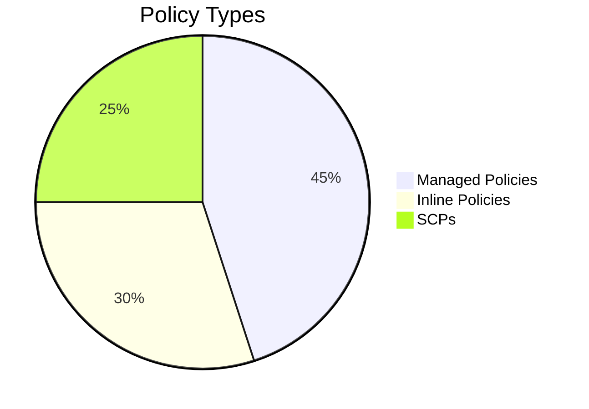

# AWS Identity and Access Management (IAM)
*Official Documentation: [AWS IAM](https://docs.aws.amazon.com/IAM/latest/UserGuide/introduction.html)*

## 1. Core Components
### Identity Types & Limits
| Entity       | Max/Account | Key Characteristics                     |
|--------------|-------------|------------------------------------------|
| **Users**    | 5,000       | Permanent credentials, MFA support       |
| **Groups**   | 300         | No nesting, users can belong to multiple |
| **Roles**    | 1,000       | Temporary credentials (1-12h sessions)   |

*Source: [IAM Quotas](https://docs.aws.amazon.com/IAM/latest/UserGuide/reference_iam-quotas.html)*

---

## 2. Policy Framework
### Policy Types Comparison


### Key Syntax Elements:

```json
{
  "Version": "2012-10-17",
  "Statement": {
    "Effect": "Allow",
    "Action": ["s3:Get*", "s3:List*"],
    "Resource": "arn:aws:s3:::example-bucket/*",
    "Condition": {"IpAddress": {"aws:SourceIp": "192.0.2.0/24"}}
  }
}
```
*[Policy Syntax Guide](https://docs.aws.amazon.com/IAM/latest/UserGuide/reference_policies_elements.html)*

## 3. Security Controls
### Critical Features
1. MFA Enforcement

```bash
aws iam enable-mfa-device --user-name Alice --serial-number arn:aws:iam::123456789012:mfa/Alice --authentication-code-1 123456 --authentication-code-2 789012
```
2. Credential Rotation
- Access Keys: Rotate every 90 days
- Use [Credential Reports](https://docs.aws.amazon.com/IAM/latest/UserGuide/id_credentials_getting-report.html) for auditing

3. Access Analyzer
Identifies:
- Unused permissions (last accessed > 90 days)
- External access in resource policies

## 4. Interview Q&A
### Technical Questions
> Q1. Explain the difference between IAM roles and users?
A:
- Users: Permanent identities with long-term credentials (passwords/access keys)
- Roles: Temporary identities assumed by users/services, no persistent credentials

> Q2. How does policy evaluation work in IAM?
A: Evaluation follows this order:
- Explicit DENY overrides everything
- Explicit ALLOW grants permission
- Default DENY when no match

Ref: *[Policy Evaluation Logic](https://docs.aws.amazon.com/IAM/latest/UserGuide/reference_policies_evaluation-logic.html)*

**Scenario-Based Questions**
> Q3. How would you grant cross-account S3 access?
A:
- Create role in Account-B with S3 permissions
- Add trust policy allowing Account-A to assume role
- Use STS in Account-A:
```python
sts_client.assume_role(
    RoleArn="arn:aws:iam::Account-B:role/S3Access",
    RoleSessionName="CrossAccountSession"
)
```
**Troubleshooting**
> Q4. A user reports "Access Denied" despite having correct permissions. What would you check?
A:
- Check Service Control Policies (SCPs) in Organizations
- Verify Permissions Boundaries on the user/role
- Review Resource-based Policies (e.g., S3 bucket policy)
- Check for Explicit Denies in policies

> 5. Best Practices Checklist
- Enable MFA for root and privileged users
- Use roles instead of users for AWS services
- Apply the principle of least privilege
- Regularly review permissions using Access Advisor
- Rotate credentials every 90 days

Complete Guide: *[IAM Best Practices](https://docs.aws.amazon.com/IAM/latest/UserGuide/best-practices.html)*

### Key Features:
1. **Technical Depth** with exact CLI commands and JSON examples
2. **Visual Aids** using Mermaid diagrams and tables
3. **Interview Prep** with categorized Q&A (technical + scenario-based)
4. **Actionable Checklists** for implementation
5. **Direct AWS Links** for every major concept
