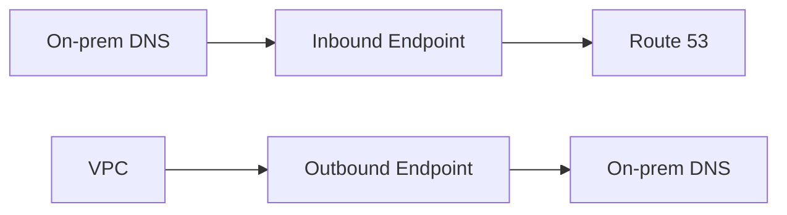

# Amazon Route 53 - Complete Documentation
Amazon Route 53 is a scalable and highly available Domain Name System (DNS) web service offered by AWS. 
It provides three main functions: 
- Domain registration, 
- DNS routing, and 
- Health checking of resources. 

The name "Route 53" comes from TCP/UDP port 53 (where DNS requests are handled) and the iconic "Route 66" highway in the USA, symbolizing routing traffic to Amazon DNS 11.

### Key Characteristics
- 100% SLA availability
- Low-latency DNS responses
- Global network of DNS servers
- Tight integration with AWS services
- Real-time traffic management

## Core Concepts

### Domain Registration

#### Components:
1. **Domain Name**: Human-readable address (example.com)
2. **Domain Registrar**: ICANN-accredited company managing domains
3. **Registry**: Organization owning TLD rights (e.g., VeriSign for .com)
4. **Top-Level Domains (TLDs)**:
   - gTLDs: .com, .org, .net
   - ccTLDs: Country-specific (.uk, .jp)

#### Route 53 as Registrar:
- Reseller for Amazon Registrar and Gandi
- Supports 400+ TLDs
- Automated domain management

### DNS Fundamentals

#### Key Terms:
- **Alias Record**: Route 53-specific record pointing to AWS resources
- **Authoritative Name Server**: Definitive source for DNS information
- **CIDR Block**: IP address range notation
- **DNS Query**: Request to resolve domain to IP
- **Hosted Zone**: Container for DNS records
- **Name Server**: Translates domains to IPs

#### Record Types:
| Type    | Purpose                          |
|---------|----------------------------------|
| A       | IPv4 address                     |
| AAAA    | IPv6 address                     |
| CNAME   | Canonical name (alias)           |
| MX      | Mail exchange                    |
| NS      | Name server                      |
| PTR     | Pointer (reverse DNS)            |
| SOA     | Start of authority               |
| TXT     | Text records                     |

## Route 53 Features

1. **Domain Registration**
   - Search/register/transfer domains
   - Automatic renewal options

2. **DNS Service**
   - Authoritative DNS service
   - Anycast routing for low latency

3. **Traffic Management**
   - Multiple routing policies
   - Traffic Flow visual editor

4. **Health Checking**
   - Monitor endpoints
   - Automated failover

5. **Private DNS**
   - Internal domain management
   - VPC integration

6. **Resolver**
   - Hybrid cloud DNS resolution
   - Inbound/Outbound endpoints

7. **DNS Firewall**
   - Block malicious domains
   - Custom rule sets

## Routing Policies

| Policy Type          | Description                                | Use Case                          |
|----------------------|--------------------------------------------|-----------------------------------|
| Simple               | Basic round-robin                          | Single resource                   |
| Weighted             | Distribute traffic by assigned weights     | A/B testing, blue-green           |
| Latency-Based        | Route to region with lowest latency        | Global applications               |
| Failover             | Active-passive configuration               | Disaster recovery                 |
| Geolocation          | Route based on user location               | Regional content                  |
| Geoproximity         | Route based on geographic distance         | Compliance requirements           |
| Multivalue Answer    | Return multiple healthy records            | Increase availability             |

## Hosted Zones

### Types:
1. **Public Hosted Zone**
   - Routes internet traffic
   - Accessible globally
   - Associated with domain names

2. **Private Hosted Zone**
   - Routes VPC traffic
   - Internal resources only
   - Multiple VPC associations

### Record TTLs:
- Time-To-Live (TTL) controls caching
- Lower TTL = faster changes propagate
- Higher TTL = reduced DNS queries

## Route 53 Resolver

### Components:
1. **Inbound Endpoint**
   - On-premises → AWS resolution
   - Requires security group rules

2. **Outbound Endpoint**
   - AWS → on-premises resolution
   - Forwarding rules required

3. **DNS Firewall**
   - Domain filtering
   - Threat protection

### Hybrid Cloud Setup:

## Pricing
Route 53 pricing follows AWS's pay-as-you-go model:
- **Hosted Zones**: $0.50/month for first 25 zones, then $0.10/zone
- **DNS Queries**: Charged per million queries (varies by query type)
- **Domain Registration**: Varies by TLD (typically $10-$15/year for common TLDs)
- **Health Checks**: $0.50/month per health check (after first 50)

## Important Interview Questions and Answers

### Q: What is Amazon Route 53?
A: Route 53 is AWS's scalable and highly available DNS web service that provides domain registration, DNS routing, and health checking capabilities.

### Q: Why is it called Route 53?
A: It references TCP/UDP port 53 (used for DNS) and the iconic Route 66 highway, symbolizing routing traffic.

### Q: What are the main types of routing policies in Route 53?
A: Simple, Weighted, Latency-Based, Failover, Geolocation, Geoproximity, and Multivalue Answer routing.

### Q: What's the difference between Alias records and CNAME records?
A: Alias records are Route 53-specific and can be used for the zone apex (naked domain), while CNAME records cannot. Alias records are also free of charge.

### Q: How does Route 53 handle DNS resolution between VPC and on-premises?
A: Using Route 53 Resolver with Inbound and Outbound Endpoints.

### Q: What are hosted zones in Route 53?
A: Containers that hold DNS records for a domain and its subdomains. Can be public (for internet) or private (for VPC).

### Q: How does latency-based routing work?
A: Route 53 uses latency measurements between networks and AWS regions to route traffic to the region that provides the lowest latency.

### Q: What is the difference between geolocation and latency-based routing?
A: Geolocation routes based on user's physical location, while latency-based routes based on measured network latency.

### Q: How can you delegate a subdomain to Route 53?
A: By creating NS records in the parent domain that point to Route 53 name servers for the subdomain.

### Q: What are some key benefits of using Route 53?
A: High availability, scalability, tight AWS integration, multiple routing policies, health checking, and global network of DNS servers.

## Practical Use Cases
- **Global Traffic Management**: Complex routing relationships across regions
- **High Availability Applications**: Automatic failover between resources
- **Private DNS**: Custom domain names within VPC without public exposure
- **Hybrid Cloud**: DNS resolution between AWS and on-premises
- **Domain Registration**: Purchase and manage domains directly in AWS

## Migration Considerations
When migrating from on-premises DNS to Route 53, consider:
- **Full Migration**: Moving entire domain to Route 53
- **Subdomain Delegation**: Keeping main domain on-premises while delegating subdomains
- **TTL Values**: Reducing TTL before migration for faster propagation
- **Firewall Rules**: Ensuring communication between on-premises and Route 53 endpoints

## Best Practices
- Use Alias records when possible (free and support zone apex)
- Implement health checks for critical resources
- Choose appropriate routing policies based on use case
- For global applications, consider latency-based routing
- Monitor DNS query costs for high-traffic domains
- Use private hosted zones for internal resources
- Implement DNS Firewall for security

## Limitations
- Maximum of 50 domain registrations per account
- Some advanced features require Traffic Flow (additional cost)
- DNS propagation still takes time (though typically fast with Route 53)